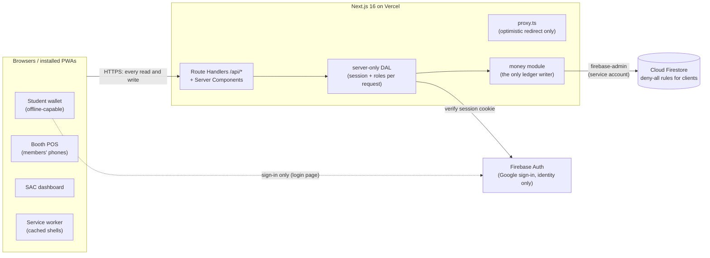

# Architecture

FraserPay v2 is a closed-loop digital credit system for a school event: students load credit **in person** at the SAC table, spend it at student-run booths via QR code, and SAC administers everything from a live dashboard. No real money moves through the app: cash and card are handled physically at the SAC table, so there is no payments-compliance surface. What the app owns instead is **integrity**: balances that can never be corrupted, double-spent, or edited without a trace.

The predecessor app talked to Firebase directly from the browser, which meant any student with devtools could issue their own database calls and forge balance math. v2's foundational rule reverses that completely:

> **No client ever touches the database.** Every read and write goes through server-side code that enforces role checks; Firestore Security Rules deny all client access unconditionally.

Everything else in this document is a consequence of that rule plus three design pillars: integrity (an append-only ledger under ACID transactions), speed under terrible school WiFi (cache-first shells, one tiny request per charge), and auditability (every action attributable, a live feed, end-of-day reconciliation).

## System overview



| Component                       | Responsibility                                                                                                                                                |
| ------------------------------- | ------------------------------------------------------------------------------------------------------------------------------------------------------------- |
| Next.js app (Vercel)            | All UI, all business logic, all database access; the only reader/writer of Firestore                                                                          |
| Firebase Auth                   | Google sign-in, identity provider only; the client SDK exists solely on the login page to obtain an ID token, which the server exchanges for a session cookie |
| Cloud Firestore                 | The single database: users, booths, ledger, audit log, idempotency records, rate-limit counters                                                               |
| Service worker (`public/sw.js`) | Hand-rolled offline shell: wallet + POS pages open from device cache with zero network                                                                        |
| Firebase Emulator Suite         | Local development and CI: Auth + Firestore emulated, no cloud project or credentials needed                                                                   |

**Deliberately absent:** Cloud Functions (all logic runs in request handlers; no triggers or cron), Firebase Storage (no uploads), email/notification services (join codes are emailed manually by SAC), Redis/queues (Firestore covers rate limiting and idempotency at this scale), realtime channels (the feed polls every 60 s). Configuration like caps and rates are **code constants**, not a database collection: the PRD fixes them, and changing them should cost a deploy.

## Request anatomy

Every API route is built on one shared handler wrapper (`src/lib/server/http.ts`), so consistent auth, validation, logging, and error behavior exist by construction rather than convention:

```
request
  │ 1. request-ID generated
  │ 2. session cookie verified; user doc loaded fresh (roles, suspension), never trusted from the client
  │ 3. role guard (student / booth member / SAC member / SAC exec)
  │ 4. rate limit (Firestore fixed-window counter)
  │ 5. same-origin check on mutations (Origin / Sec-Fetch-Site), the CSRF layer on top of SameSite cookies
  │ 6. Zod parse of body/query; malformed amounts can't reach business logic
  ▼
handler (money module / read model)
  │ 7. one structured JSON log line
  ▼
response, or error envelope { error: { code, message, requestId } }
```

Error codes are a stable enum (`VALIDATION`, `UNAUTHORIZED`, `FORBIDDEN`, `SUSPENDED`, `NOT_FOUND`, `INSUFFICIENT_FUNDS`, `CAP_EXCEEDED`, `IDEMPOTENCY_CONFLICT`, `RATE_LIMITED`, `BOOTH_NOT_SELLABLE`, `CONFLICT`, `INTERNAL`), and the POS/dashboard map each to operator-actionable copy. Business rejections render as non-blocking toasts with form/cart state preserved, never navigation to an error screen.

`src/proxy.ts` (Next 16's successor to middleware) does exactly one optimistic thing: cookieless page requests bounce to `/login`. It never decodes or trusts the cookie; the DAL is the enforcement point on every request.

## Authentication and roles

1. `/login` is the **only** page that loads the Firebase client SDK. `signInWithPopup` (Google) yields an ID token.
2. `POST /api/auth/session` verifies the token server-side (`email_verified` and an `@pdsb.net` address are required; the OAuth `hd` hint is never trusted), provisions the user document on first sign-in, and mints an `httpOnly; Secure; SameSite=Lax` session cookie (7-day TTL).
3. Student numbers are **derived from the email** (`studentnumber@pdsb.net`), never self-entered; they arrive pre-verified through Google OAuth. Non-numeric local parts (teachers) get accounts with no student number and no special powers.
4. Sign-out clears the cookie, revokes refresh tokens, and returns `Clear-Site-Data` so a shared device retains nothing personal.

Roles **stack on one account** and live on the Firestore user document, read fresh by the DAL each request, so revocation and suspension are instant (no stale custom claims):

| Capability                                                                                              | Student | Booth member | SAC member | SAC exec |
| ------------------------------------------------------------------------------------------------------- | :-----: | :----------: | :--------: | :------: |
| Wallet, own history, leaderboard, register/join booths                                                  |   ✅    |      ✅      |     ✅     |    ✅    |
| POS: buyer lookup + charge (own booth)                                                                  |    -    |      ✅      |     -      |   ✅*    |
| Top-ups, student lookup, audit feed, reports, reconciliation, account activity                          |    -    |      -       |     ✅     |    ✅    |
| Refunds, adjustments, cap overrides, payment-code regen, suspensions, role grants, all booth management |    -    |      -       |     -      |    ✅    |

\* Execs charge only for booths they've actually joined; exec does not imply booth membership.

SAC is deliberately two-tiered: members get the table-shift powers, execs get the sharp knives. That limits the blast radius of any one careless or compromised account among 10 to 20 SAC workers. A further separation-of-duties rule: **no SAC worker can ever top up, adjust, or refund their own account**, rejected server-side in the money module, the same two-person control that applies to the physical cash box.

## The money module

`src/lib/server/money/` is the **only** code that writes balances, points, or ledger entries. Four operations (`topUp`, `charge`, `refundPurchase`, `adjustBalance`) are all instances of one transaction recipe. Here is a charge:

```
POST /api/booth/charge          (Idempotency-Key: <uuid, one per operator gesture>)
  │
  ▼ runTransaction: serializable, auto-retried on contention
  1. get idempotency/{actorUid_key}     exists? → return the stored response (replay), stop
  2. get users/{buyer}                  must exist, not suspended
  3. get booths/{id} + members/{op}     booth approved; operator is a member, checked in-transaction
  4. price the cart FROM THE BOOTH DOC  client sends {itemId, qty} only; prices are never client-supplied
  5. total ≤ balance?                   else INSUFFICIENT_FUNDS with zero writes
  6. tag "high-amount" if > $15
  7. writes, atomically:                create ledger entry
                                        update user balance (+ points if top-up)
                                        create idempotency record
  └── commit: all or nothing
```

The invariants the module enforces (each with named tests):

- **I1**: every amount is integer cents and a multiple of 50; nothing in the system can create any other amount
- **I2**: no code path ever produces a negative balance; **no override exists**
- **I3**: every balance change happens inside one transaction that also appends exactly one ledger entry
- **I4**: ledger and audit-log documents are never updated or deleted by application code
- **I5**: every mutating money endpoint requires an `Idempotency-Key`; replays return the stored original response and never re-execute
- **I6**: points change only with top-ups (5/$1, half-points exact) and top-up-linked corrections (pro-rata reversal, floored at 0), atomically with the money write
- **I7**: server-enforced caps: $100 per top-up, $200 resulting balance; exceeding either requires exec role + a reason and tags the entry `cap-override`
- **I8**: purchases over $15 are tagged `high-amount` server-side and surface in the SAC feed
- **I9**: authorization is re-checked server-side on every request from a fresh user document
- **I10**: booth-facing responses reveal only the buyer's name, balance, and that booth's own last sale to them within 10 minutes; never points, never activity elsewhere. Sufficiency is derived on the client from that balance, so the server is never told the cart total
- **I11**: the server never accepts client-supplied prices; carts are priced from the booth document at execution time
- **I12**: no self-dealing: `topUp`/`adjustBalance`/`refundPurchase` reject `actor === target`

There is no top-up-reversal ledger type: execs correct erroneous top-ups with **adjustments** that may reference the original, and a linked adjustment reverses points pro-rata automatically. Fewer code paths, same guarantee.

### Idempotency, precisely

- Key = client-generated UUID, one per user gesture, reused across retries. Records are stored as `{actorUid}_{key}` (scoped per actor), created **inside** the money transaction, so two concurrent requests with the same key race on that create, exactly one executes, and the loser returns the stored response. This exact race is an integration test.
- A replay with a matching body hash returns HTTP 200 with the byte-identical stored response plus `Idempotent-Replay: true`; a replay with a _different_ body is a `409 IDEMPOTENCY_CONFLICT`. Records expire after 72 h via Firestore TTL, far beyond any real retry horizon.
- The client only shows "Already processed, no new charge" when the operator **knowingly reused a held key**. A fresh key that reports "replayed" can only be the client's own internal retry, meaning money _did_ move, and showing replay copy there would tell the operator the sale failed and invite a real double charge.

### Crash recovery on the POS

A tab discard or app kill mid-charge would leave the operator with silence and no held key, and re-ringing would mint a fresh key and charge twice. So the POS **persists the key, cart, buyer, and amount to `localStorage` before sending**. On the next launch, a surviving record raises a recovery card whose Retry replays the _same_ key, so at most one charge exists either way. Retry is offered for 15 minutes from the attempt; past that, the card points the operator at SAC and the audit feed. The record is cleared only on outcomes that prove the original's fate (a 200, or an error that can only be raised inside the transaction); a rate-limit or network error says nothing about the original attempt, so the record survives it.

## Data model

All access via `firebase-admin` on the server. `firestore.rules` denies all client reads and writes unconditionally: two lines, covered by tests that must never stop passing.

| Collection                      | Contents                                                                                                                                                                                                                                                                                                 |
| ------------------------------- | -------------------------------------------------------------------------------------------------------------------------------------------------------------------------------------------------------------------------------------------------------------------------------------------------------- |
| `users/{uid}`                   | email, display name, `studentNumber \| null`, payment code, cached `balanceCents` + `points` (truth is always re-derivable from the ledger), roles, suspension flag                                                                                                                                      |
| `booths/{boothId}`              | name, description, status (`pending → approved ⇄ deactivated`), item catalog with prices, join code, submitter identity (for the human teacher check)                                                                                                                                                    |
| `booths/{id}/members/{uid}`     | booth membership; "my booths" is a collection-group query                                                                                                                                                                                                                                                |
| `ledger/{entryId}`              | append-only: type (`topup` / `purchase` / `refund` / `adjustment`), amount + direction, `balanceAfterCents`, denormalized student/actor/booth names (the feed renders without joins), line items, method, tags, reason, link to the original entry, points delta, idempotency key, Toronto calendar date |
| `auditLog/{id}`                 | append-only admin events with actor, target, and details: approvals, price edits (with diffs), code rotations, member removals, de/reactivations, suspensions, role grants, payment-code regens                                                                                                          |
| `idempotency/{actorUid_key}`    | stored responses for replay; TTL 72 h                                                                                                                                                                                                                                                                    |
| `rateLimits/{scope_key_window}` | fixed-window counters; TTL cleanup                                                                                                                                                                                                                                                                       |

Two details worth calling out:

- **Payment codes** are 128-bit CSPRNG values (26-char Crockford base32, `fp1-` prefix): opaque, containing no student information, individually regenerable by an exec if photographed or leaked. The QR encodes only this string.
- **Aggregates are computed, never counted** — by the cheapest query that answers the question. A surface that needs the **item breakdown** (booth summary, reconciliation) reads that one indexed ledger slice and groups in memory; a surface that needs only **scalars** (leaderboard gross, report rows, top-up totals, outstanding liability) uses a Firestore SUM/COUNT aggregation query and reads no documents at all. Cached per product cadence (leaderboard 15 min, reports 60 s). No counter documents; the ledger is the single source of truth, and a standing verifier (`pnpm verify:ledger`) recomputes every balance from it and must always agree.

## API surface

| Endpoint                                                                                                          | Role                | Notes                                                                                                                                                                                     |
| ----------------------------------------------------------------------------------------------------------------- | ------------------- | ----------------------------------------------------------------------------------------------------------------------------------------------------------------------------------------- |
| `POST /api/auth/session` · `signout`                                                                              | public / session    | token → cookie; sign-out revokes + purges                                                                                                                                                 |
| `GET /api/wallet`                                                                                                 | student             | balance, points, `asOf`, last-20 fully itemized history                                                                                                                                   |
| `POST /api/booths/register` · `join`                                                                              | any active user     | open registration; join by code                                                                                                                                                           |
| `POST /api/booth/lookup`                                                                                          | booth member        | `{boothId, buyer}` (payment code only) → name + balance + own-booth last sale, **nothing else**; called once per buyer, not per cart change                                               |
| `POST /api/booth/charge`                                                                                          | booth member        | idempotent; request/response bodies < 2 KB by test                                                                                                                                        |
| `GET /api/booth/[id]/summary`                                                                                     | that booth's member | own totals + per-item breakdown                                                                                                                                                           |
| `POST /api/sac/topup` · `POST /api/sac/lookup`                                                                    | SAC member          | idempotent top-up with caps; name-confirm lookup                                                                                                                                          |
| `GET /api/sac/students` · `students/[uid]/ledger` · `feed` · `reconciliation` · `reports` · `booths/[id]/summary` | SAC member          | search, full histories, merged ledger+audit feed (one filter at a time, plus the repeat-charge alert), per-member day totals by method, event reports, per-booth item breakdown on demand |
| `POST /api/exec/refund` · `adjust`                                                                                | SAC exec            | idempotent money corrections, reason required                                                                                                                                             |
| `POST /api/exec/payment-code` · `suspend` · `roles`                                                               | SAC exec            | audited account controls                                                                                                                                                                  |
| `POST /api/exec/booths/[id]/…`                                                                                    | SAC exec            | approve (mints join code), price edits, rotate code, remove member, de/reactivate, all audited                                                                                            |

The leaderboard is a page, not an API: a Server Component behind a 15-minute shared cache.

Money endpoints are deliberately plain Route Handlers rather than Server Actions: stable URLs survive mid-event deploys, payloads are exactly controlled (the charge round-trip budget is < 2 KB each way), and rate limiting and load tests target real URLs.

## Rate limiting

Fixed-window Firestore counters checked in the wrapper before business logic: no extra vendor, portable, sufficient at the event's ~10 requests/sec scale:

| Scope              | Limit                   | Why                    |
| ------------------ | ----------------------- | ---------------------- |
| booth registration | 20 / 10 min             | pending-booth spam     |
| join-code attempts | 20 / 10 min             | code guessing          |
| buyer lookup       | 120 / min per operator  | runaway-client ceiling |
| charge             | 120 / min per operator  |                        |
| top-up             | 40 / min per SAC member |                        |
| exec mutations     | 60 / min                |                        |
| reads              | 120 / min               |                        |

**The limits are deliberately loose.** They bound a runaway or hostile client; they are not the enumeration control. Since booth lookup accepts only an unguessable payment code, what an endpoint _accepts_ is the enumeration bound, and a lunch-rush operator ringing a sale every three seconds must never meet a 429. Abuse _within_ the limits is caught by `/admin/activity`, which reads the limiter's own counter documents (no extra write per request) and lists accounts that pushed a window, and answered with suspension.

Money scopes **fail closed** if the limiter is unreachable; pure reads fail open. An idempotent replay refunds its token — credited as a `refunds` counter rather than subtracted, so a window serves at most 2× its limit however many replays arrive, and `count` stays the honest request total `/admin/activity` reports. Sign-in is deliberately _not_ rate-limited: before authentication the only per-caller identifier is the IP, and at a school event the entire crowd shares one NAT egress IP; any IP limit low enough to matter would lock out real students. The endpoint is already gated by Google-signed, domain-verified ID tokens.

On enumeration math: payment codes live in a 2¹²⁸ space, so guessing is meaningless. Booth join codes pair a public name-derived prefix with a 5-character random suffix over a 31-character unambiguous alphabet (~28.6 M combinations); combined with the per-user attempt limiter and an identical error for unknown-vs-unapproved codes, guessing is impractical and yields no oracle.

## Offline and the PWA

The wallet must survive a gym full of phones on saturated WiFi:

- A hand-rolled ~150-line service worker (Serwist needs webpack; Next 16 is Turbopack) precaches shell assets and serves `/wallet` and `/sell/*` HTML **cache-first with background revalidation**; after the first visit, the wallet opens with zero network requests, QR included.
- `/api/*` is **never cached**. The POS must hit the network to charge: that online-required stance is the anti-double-spend design, not a limitation. A connectivity probe drives an unmistakable offline banner that disables Charge.
- The wallet page ships no client components: just a server-rendered inline-SVG QR and a ~1 KB inline refresh script that updates balance/history opportunistically and styles the "as of" stamp stale when offline.
- Cached wallet HTML is personal, so sign-out sends `Clear-Site-Data` _and_ messages the worker to purge its caches.

Performance is enforced, not hoped for: the first-visit wallet transfer budget (≤ 170 KB compressed; ≈ 157 KB measured, sitting just above Next 16's ~113 KB App Router framework floor) is asserted by a CI test that sums real transfer sizes. Route groups `(student)` / `(booth)` / `(sac)` split code by role, so a student never downloads booth or admin JavaScript, and the Firebase SDK chunk exists only on `/login`.

## Security posture

- **Deny-all Firestore rules**, tested; service-account credentials exist only in server env vars; CI greps built client bundles for secret markers.
- **CSP with per-request nonces** (no `unsafe-inline`; Google's OAuth origins are the only third-party allowance, used solely by the login flow), plus HSTS, `X-Content-Type-Options`, `Referrer-Policy`, and camera-scoped `Permissions-Policy`.
- **CSRF**: `SameSite=Lax` cookies plus an explicit cross-site `Origin`/`Sec-Fetch-Site` rejection on every mutation (Route Handlers don't get Server Actions' built-in check, so the wrapper does it).
- **Least disclosure** everywhere: booths see name + balance + their own last sale to that buyer, and nothing else — no points, no activity at other booths, no contact details. The balance is deliberately booth-visible (the operator has to say how short a buyer is), which is exactly why lookup accepts **only** an unguessable payment code: the enumeration bound is the identifier, not the rate limit. Logs carry no names, amounts, or payment codes (a closed log-field schema makes over-logging a type error; the ledger, not the log, is the record of what happened).
- **Auditability as deterrent**: every sharp-knife action writes the audit log; high-amount charges surface in the live feed; suspension severs a compromised account instantly. The feed also banners any buyer charged 10+ times in the last 10 minutes — the signature of a leaked payment code — computed read-side on each feed load rather than tagged at charge time, so the money path pays nothing for it. It is a prompt to look, not a block.

## Testing strategy

| Layer            | Tooling                                | What it proves                                                                                                                                                                                                                                       |
| ---------------- | -------------------------------------- | ---------------------------------------------------------------------------------------------------------------------------------------------------------------------------------------------------------------------------------------------------- |
| Unit / component | Vitest                                 | money math and invariant guards at 100% branch coverage, schemas, points (incl. half-points), code generators, SW strategy logic, POS cart/recovery UI                                                                                               |
| Integration      | Vitest + Firebase Emulator Suite       | every endpoint's happy + error paths against real emulated Firestore: transaction atomicity, the concurrent idempotency race, contention storms (N parallel charges → exactly ⌊balance/price⌋ succeed), caps, refund-beyond-refunded, deny-all rules |
| End-to-end       | Playwright vs `next start` + emulators | 8 user journeys (onboarding→wallet, booth lifecycle, top-up guards, refund, adjustment, suspension, roles, feed+leaderboard) plus offline-wallet, transfer-budget, and axe accessibility suites                                                      |
| Load             | k6                                     | the lunch-rush scenario (sustained 10 charges/sec, p95 < 500 ms threshold) and a correctness storm, with `verify:ledger` proving zero divergence afterward                                                                                           |

Everything runs against emulators; no test ever needs a cloud project. CI is two-tier: static/unit/build/security on every push, the emulator-backed integration + E2E tiers on demand before merges that touch money paths.

## Repository map

| Path                                                              | Responsibility                                                                                                              |
| ----------------------------------------------------------------- | --------------------------------------------------------------------------------------------------------------------------- |
| `src/app/api/**`                                                  | Route Handlers: the only database-writing surface                                                                           |
| `src/app/(public)` `(student)` `(booth)` `(sac)`                  | role-split route groups: login, wallet/leaderboard/booth forms, POS, admin dashboard                                        |
| `src/proxy.ts`                                                    | optimistic cookieless-request redirect (never an auth boundary)                                                             |
| `src/lib/server/http.ts`                                          | the handler wrapper: auth → role → rate limit → validate → log → envelope                                                   |
| `src/lib/server/dal.ts`                                           | session verification + fresh role/suspension loading, per-request memoized                                                  |
| `src/lib/server/money/`                                           | the four money operations + invariant guards; sole writer of balances and ledger                                            |
| `src/lib/server/idempotency.ts` · `ratelimit.ts` · `audit.ts`     | the money-safety primitives                                                                                                 |
| `src/lib/server/{booth-lookup,sac-*,leaderboard}.ts`              | read models: lookup, feed, reconciliation, reports, students, leaderboard                                                   |
| `src/lib/server/{paymentCode,boothCode,qr}.ts`                    | CSPRNG code generation, server-side QR SVG                                                                                  |
| `src/lib/server/site.ts` + `app/{robots,sitemap,opengraph-image}` | the signed-out public surface: canonical origin, JSON-LD, OG image, `robots.txt`/`sitemap.xml`/`llms.txt`                   |
| `src/lib/shared/`                                                 | isomorphic constants, money math, Zod schemas, DTO types; client forms and server handlers validate with the same schemas   |
| `src/lib/ui/`                                                     | client leaves: scanner, POS charge hook + pending-charge persistence, shell/mode switch, sign-in                            |
| `sw/` → `public/sw.js`                                            | service-worker template, stamped with a build version at build time                                                         |
| `scripts/`                                                        | seed data, superadmin bootstrap, ledger verifier, load fixtures + integrity check, security scans, the guarded balance wipe |
| `tests/integration/` · `e2e/` · `load/`                           | emulator integration suites, Playwright journeys, k6 scenarios                                                              |
| `firestore.rules` · `firestore.indexes.json`                      | deny-all rules; composite indexes + TTL policies, version-controlled and deployed explicitly                                |

## Design choices, briefly

- **One database, no second service.** Firestore's serializable transactions + a single money module + deny-all rules stand in for "row locks and constraints". Postgres would have been a second managed service with connection pooling on serverless for no product gain at this scale.
- **Session cookies over bearer tokens**: auth material stays out of client JavaScript, and Firebase console user management is retained.
- **Polling over realtime.** The feed polls every 60 s per the product spec; realtime channels would add infrastructure for a cadence the event doesn't need.
- **Denormalized names in ledger entries**: the feed renders without joins; names are effectively static during a short event.
- **In-memory aggregation over counters**: live counters invite hot-document contention and drift; the per-booth summaries were needed for item breakdowns anyway, so one pass covers both.
- **Environment-agnostic repo.** No project IDs, domains, or secrets in tracked files; a stranger can stand up staging and production from scratch with their own Firebase + Vercel projects, following the same documented bootstrap. Local development is emulator-first under a throwaway `demo-` project ID that Firebase guarantees never contacts a real backend.
- **Deliberate operational friction where it counts.** The post-event balance wipe requires the project ID typed twice plus an explicit fresh-export flag, zeroes balances only, and preserves points and the full ledger: auditable and reconstructable afterward.

## Running it

```bash
pnpm install
pnpm dev:emulators                      # terminal 1: Auth + Firestore emulators
set -a && . ./.env.demo && set +a && pnpm seed:dev
pnpm dev:demo                           # terminal 2: app on http://127.0.0.1:3000

pnpm typecheck && pnpm lint && pnpm test   # the fast local gate
pnpm test:integration:emulate              # emulator-backed integration suite
pnpm test:e2e                              # Playwright journeys
pnpm verify:ledger                         # balances ≡ ledger, always
```

No cloud project, no credentials: the emulators are the whole backend locally. Full setup detail lives in the [README](./README.md).
