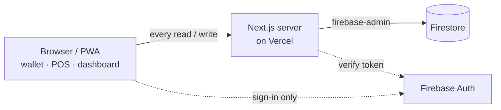

# FraserPay v2

Closed-loop digital credit system for a school event(s) at John Fraser SS. Students load credit **in person** at the SAC booth, then spend it at student-run booths with a QR code. No real money ever moves through the app, so there is no payments-compliance surface.


---

## Architecture

Clients reach Firebase Auth only to sign in; every read and write goes through the Next.js server, the holder of database credentials.



- **Clients are locked out of Firestore.** Security Rules deny all client access, so the server is the only reader and writer.
- **Every cent is explainable.** Balances are derived from an append-only ledger, and the money module enforces invariants `I1`–`I11`.
- **Built for bad WiFi.** The wallet renders from device cache with near-zero network, and a booth charge is one small server request.

---

## Tech stack

| Layer       | Choice                                                                          |
| ----------- | ------------------------------------------------------------------------------- |
| Framework   | Next.js 16 (App Router, RSC, Turbopack), TypeScript strict                      |
| UI          | React 19, Tailwind CSS v4, scoped shadcn/ui                                     |
| Server data | `firebase-admin` (service account), guarded by `server-only`                    |
| Auth        | Firebase Auth (Google, `@pdsb.net`), client SDK on the login page only          |
| Validation  | Zod (schemas shared client and server)                                          |
| Offline     | Hand-rolled service worker (wallet + POS shell)                                 |
| Tests       | Vitest, `@firebase/rules-unit-testing`, Firebase Emulator Suite, Playwright, k6 |
| Tooling     | pnpm, mise (Node 24), ESLint 9, Prettier                                        |

---

## Quick start

Local development is **emulator-first**: the Firebase Emulator Suite stands in for Auth and Firestore, so you need no cloud project and no credentials. Emulators always run under the throwaway `demo-fraserpay` project, and the `demo-` prefix makes Firebase refuse to contact any real backend.

**Prerequisites**

| Tool                                                 | Notes                                                          |
| ---------------------------------------------------- | -------------------------------------------------------------- |
| [mise](https://mise.jdx.dev)                         | Manages the Node 24 toolchain (see [`mise.toml`](./mise.toml)) |
| [pnpm](https://pnpm.io)                              | Package manager, v11 (`corepack enable`)                       |
| [Firebase CLI](https://firebase.google.com/docs/cli) | Provides the emulators (`pnpm add -g firebase-tools`), v13+    |
| [k6](https://k6.io)                                  | Optional, for load tests only                                  |

**Run it**

```bash
pnpm install

# terminal 1: Auth + Firestore emulators (demo-fraserpay)
pnpm dev:emulators

# terminal 2: seed fixtures into the running emulators, then start the app
set -a && . ./.env.demo && set +a && pnpm seed:dev
pnpm dev:demo
```

`dev:demo` loads [`.env.demo`](./.env.demo) (committed emulator config) so the app talks to the emulators. Open the app on `http://127.0.0.1:3000` and the Emulator UI on `http://127.0.0.1:4000`.

> Plain `pnpm dev` reads `.env.local` (your real cloud project), so use it only when pointing at a real Firebase project.

---

## Environment variables

Copy it to fill in a real project: `cp .env.example .env.local` (gitignored). Emulator work needs none of these; use `.env.demo`.

| Variable                                                                    | Purpose                                                                                          |
| --------------------------------------------------------------------------- | ------------------------------------------------------------------------------------------------ |
| `NEXT_PUBLIC_FIREBASE_API_KEY` / `_AUTH_DOMAIN` / `_PROJECT_ID` / `_APP_ID` | Public client-SDK config (login page). Ships in the browser bundle.                              |
| `FIREBASE_PROJECT_ID` / `FIREBASE_CLIENT_EMAIL` / `FIREBASE_PRIVATE_KEY`    | **Secret** Admin-SDK service account (server only). Keep the key's literal `\n` escapes, quoted. |
| `SEED_SUPERADMIN_EMAIL`                                                     | `@pdsb.net` address promoted to the first SAC exec by the seed script.                           |
| `LOG_LEVEL`                                                                 | Minimum structured-log level: `debug` \| `info` \| `warn` \| `error` (default `info`).           |
| `NEXT_PUBLIC_USE_EMULATORS`                                                 | Browser SDK to emulators when `true`. Leave blank in the cloud.                                  |
| `FIRESTORE_EMULATOR_HOST` / `FIREBASE_AUTH_EMULATOR_HOST`                   | Admin SDK to emulators. Blank in the cloud.                                                      |
| `NEXT_PUBLIC_FIREBASE_AUTH_EMULATOR_HOST`                                   | Browser Auth emulator host (defaults to `127.0.0.1:9099`).                                       |
| `DEV_ALLOWED_ORIGINS`                                                       | Extra dev-server origins (e.g. a LAN IP for on-device testing).                                  |

---

## Scripts

```bash
# develop
pnpm dev:demo               # app against the emulators (loads .env.demo)
pnpm dev:emulators          # Auth + Firestore emulators
pnpm seed:dev               # seed sample students / booths / SAC accounts
pnpm seed:superadmin        # bootstrap the first SAC exec from SEED_SUPERADMIN_EMAIL

# quality gates (the CI baseline)
pnpm typecheck              # tsc --noEmit
pnpm lint                   # ESLint
pnpm format:check           # Prettier
pnpm test                   # Vitest, unit / pure code
pnpm test:integration:emulate  # emulator-backed integration suite
pnpm test:e2e               # Playwright journeys (emulator-backed)

# ops & load
pnpm build                  # service worker + production build
pnpm verify:ledger          # audit ledger vs balance consistency
pnpm wipe:balances          # post-event balance wipe (see below)
pnpm seed:load / pnpm check:load   # k6 load fixtures + post-run integrity check
pnpm scan:security          # server-only / secret leak scans
```

**One-shot variants:** any script that needs emulators has an `…:emulate` twin (e.g. `seed:dev:emulate`, `verify:ledger:emulate`) that boots emulators, runs, and tears them down; handy in CI. Full list in [`package.json`](./package.json).

---

## Post-event balance wipe

Once the event is over and booth payouts are settled, the deployer zeroes every student balance. **Points and the append-only ledger are preserved**, so the wipe is auditable and fully reconstructable. It moves no money anywhere — it only sets each `balanceCents` to `0`.

```bash
# 1. back up first — this export is the only rollback path
gcloud firestore export gs://<bucket>/pre-wipe-$(date +%F) --project <project-id>

# 2. run the wipe (admin creds from .env.local); type the project id twice + the export gate
pnpm wipe:balances --project <project-id> --confirm <project-id> --i-have-exported
```

The script **refuses to run** unless `--project` and `--confirm` match and `--i-have-exported` is set, prompts once more for the id on a cloud run, and won't touch a cloud project while emulator host vars are set. Afterward, `pnpm verify:ledger` will report balances trailing the ledger — the expected post-wipe state.

---

## Testing

| Layer       | Command                         | Notes                                                                     |
| ----------- | ------------------------------- | ------------------------------------------------------------------------- |
| Unit / pure | `pnpm test`                     | Vitest; no emulators, never hits the network.                             |
| Integration | `pnpm test:integration:emulate` | Runs against real Auth + Firestore emulators.                             |
| End-to-end  | `pnpm test:e2e`                 | Playwright user journeys, emulator-backed.                                |
| Load        | `load/*.js`                     | k6 lunch-rush + correctness-storm ([`load/README.md`](./load/README.md)). |

The full local gate: `pnpm typecheck && pnpm lint && pnpm format:check && pnpm test`.

---

## Repo layout

```
src/
  app/              # App Router: routes + the only DB-writing /api handlers
    (public)/       # login
    (student)/      # wallet PWA, leaderboard, booth register/join
    (booth)/        # booth POS
    (sac)/          # SAC dashboard & admin
    api/            # Route Handlers
  lib/
    server/         # server-only data layer, auth, rate limiting, audit
      money/        # ledger + balance engine (invariants I1 to I11)
    shared/         # Zod schemas, types, money math (client + server)
    ui/             # client components: auth, QR scanner, PWA shell
  proxy.ts          # Next 16 proxy (optimistic; real auth re-verified in handlers)
scripts/            # seed, verify-ledger, security scans
tests/              # unit + emulator integration
e2e/                # Playwright journeys
load/               # k6 load tests
firestore.rules     # deny-all for clients
firebase.json       # emulator ports + deploy config
```
